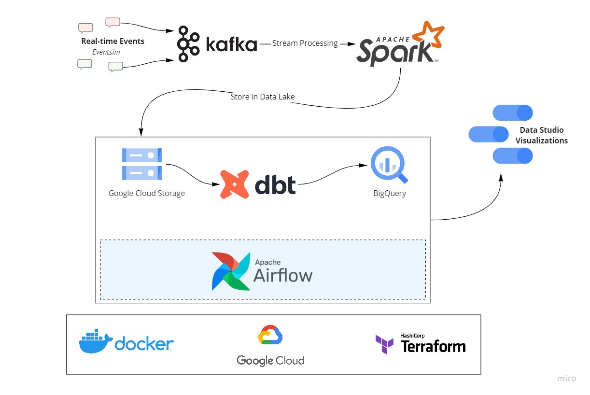

# wannabe-spotify

A data pipeline with Kafka, Spark Streaming, dbt, Docker, Airflow, Terraform, GCP and much more!

## Description

### Objective

The project will stream events generated from a fake music streaming service (like Spotify) and create a data pipeline that consumes the real-time data. The data coming in would be similar to an event of a user listening to a song, navigating on the website, authenticating. The data would be processed in real-time and stored to the data lake periodically (every two minutes). The hourly batch job will then consume this data, apply transformations, and create the desired tables for our dashboard to generate analytics. We will try to analyze metrics like popular songs, active users, user demographics etc.

### This is a work in progress!!!

### Dataset

[Eventsim](https://github.com/Interana/eventsim) is a program that generates event data to replicate page requests for a fake music web site. The results look like real use data, but are totally fake. The docker image is borrowed from [viirya's fork](https://github.com/viirya/eventsim) of it, as the original project has gone without maintenance for a few years now.

Eventsim uses song data from [Million Songs Dataset](http://millionsongdataset.com) to generate events. I have used a [subset](http://millionsongdataset.com/pages/getting-dataset/#subset) of 10000 songs.

### Tools & Technologies

- Cloud - [**Google Cloud Platform**](https://cloud.google.com)
- Infrastructure as Code software - [**Terraform**](https://www.terraform.io)
- Containerization - [**Docker**](https://www.docker.com), [**Docker Compose**](https://docs.docker.com/compose/)
- Stream Processing - [**Kafka**](https://kafka.apache.org), [**Spark Streaming**](https://spark.apache.org/docs/latest/streaming-programming-guide.html)
- Orchestration - [**Airflow**](https://airflow.apache.org)
- Transformation - [**dbt**](https://www.getdbt.com)
- Data Lake - [**Google Cloud Storage**](https://cloud.google.com/storage)
- Data Warehouse - [**BigQuery**](https://cloud.google.com/bigquery)
- Data Visualization - [**Data Studio**](https://datastudio.google.com/overview)
- Language - [**Python**](https://www.python.org)

### Architecture

## Setup

**WARNING: You will be charged for all the infra setup. You can avail 300$ in credit by creating a new account on GCP.**
### Pre-requisites

If you already have a Google Cloud account and a working terraform setup, you can skip the pre-requisite steps.

- Google Cloud Platform. 
  - [GCP Account and Access Setup](setup/gcp.md)
  - [gcloud alternate installation method - Windows](https://github.com/DataTalksClub/data-engineering-zoomcamp/blob/main/week_1_basics_n_setup/1_terraform_gcp/windows.md#google-cloud-sdk)
- Terraform
  - [Setup Terraform](https://github.com/DataTalksClub/data-engineering-zoomcamp/blob/main/week_1_basics_n_setup/1_terraform_gcp/windows.md#terraform)

### Get Going!

- Procure infra on GCP with Terraform - [Setup](setup/terraform.md)
- (Extra) SSH into your VMs, Forward Ports - [Setup](setup/ssh.md)
- Setup Kafka Compute Instance and start sending messages from Eventsim - [Setup](setup/kafka.md)
- Setup Spark Cluster for stream processing - [Setup](setup/spark.md)
- Setup Airflow on Compute Instance to trigger the hourly data pipeline - [Setup](setup/airflow.md)

### How can I make this better?!
A lot can still be done :).
- Choose managed Infra
  - Cloud Composer for Airflow
  - Confluent Cloud for Kafka
- Create your own VPC network
- Build dimensions and facts incrementally instead of full refresh
- Write data quality tests
- Create dimensional models for additional business processes
- Include CI/CD
- Finish the dashboard

